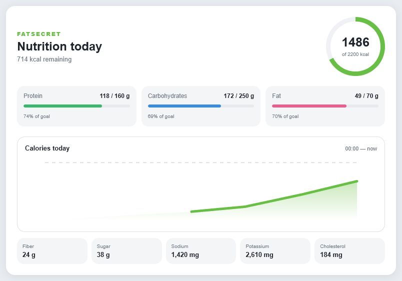

# FatSecret Dashboard Card for Home Assistant

> **Русская версия документации:** [README.ru.md](README.ru.md)

A standalone Lovelace card for the
[`xplanes/ha-fatsecret`](https://github.com/xplanes/ha-fatsecret) integration. It
shows calories, daily goals, macronutrients, additional nutrients, and a daily
calorie history chart.



## Features

- installs and updates through HACS;
- requires no Mushroom, ApexCharts, or other frontend dependencies;
- automatically uses the standard entity IDs provided by `ha-fatsecret`;
- includes a visual editor in Home Assistant;
- displays progress toward calorie, protein, fat, and carbohydrate goals;
- builds a daily SVG calorie chart from Recorder history;
- opens the standard more-info dialog when a metric is selected;
- works in desktop and narrow dashboard columns without changing the horizontal macro layout;
- follows the Home Assistant interface language for Russian and English, with English as the fallback for other languages;
- uses the colors and background of the active Home Assistant theme.

## Requirements

- an installed and configured
  [`xplanes/ha-fatsecret`](https://github.com/xplanes/ha-fatsecret) integration;
- Home Assistant 2024.4 or newer;
- HACS for automatic installation and updates.

## Installation through HACS

[](https://my.home-assistant.io/redirect/hacs_repository/?owner=BrainDeLook&repository=ha-fatsecret-dashboard&category=plugin)

Alternatively, add it manually:

1. Open **HACS → Dashboard**.
2. Open the menu and select **Custom repositories**.
3. Add `https://github.com/BrainDeLook/ha-fatsecret-dashboard` with the **Dashboard** type.
4. Find **FatSecret Dashboard Card** and select **Download**.
5. Reload Home Assistant and clear the browser cache if the old card is still displayed.

HACS installs the `ha-fatsecret-dashboard.js` resource automatically.

## Adding the card

Open the desired dashboard, select **Edit dashboard → Add card**, and choose
**FatSecret Dashboard**. The standard entity IDs and goals are prefilled and
can be changed in the visual editor.

Minimal YAML configuration:

```yaml
type: custom:fatsecret-dashboard-card
```

When `title` is not set, the card title follows the Home Assistant interface
language (`ru` or `en`). A custom `title` is always displayed as entered.

Full example:

```yaml
type: custom:fatsecret-dashboard-card
title: Nutrition today
calories_entity: sensor.calories
protein_entity: sensor.protein
carbohydrate_entity: sensor.carbohydrates
fat_entity: sensor.fat
fiber_entity: sensor.fiber
sugar_entity: sensor.sugar
sodium_entity: sensor.sodium
potassium_entity: sensor.potassium
cholesterol_entity: sensor.cholesterol
calorie_goal: 2200
protein_goal: 160
carbohydrate_goal: 250
fat_goal: 70
show_graph: true
show_details: true
```

Home Assistant may append a suffix such as `_2` when an entity ID is already
in use. In that case, select the actual entities in the card's visual editor.

## Daily chart

The card requests the short-term history of `sensor.calories` directly from
Home Assistant Recorder through the WebSocket API. Make sure the calorie sensor
is not excluded from Recorder. Other metrics continue to work if history is
unavailable.

## Optional YAML helpers

[`packages/fatsecret.yaml`](packages/fatsecret.yaml) is an optional example of
editable helpers and template sensors for progress values. It is not required
by the HACS card.

The original composite version based on standard/custom Lovelace cards is
available at [`dashboards/fatsecret-card.yaml`](dashboards/fatsecret-card.yaml).

## Development

```bash
npm run build
npm run check
```

Local preview: [`tests/preview.html`](tests/preview.html).

## License

[MIT](LICENSE)
