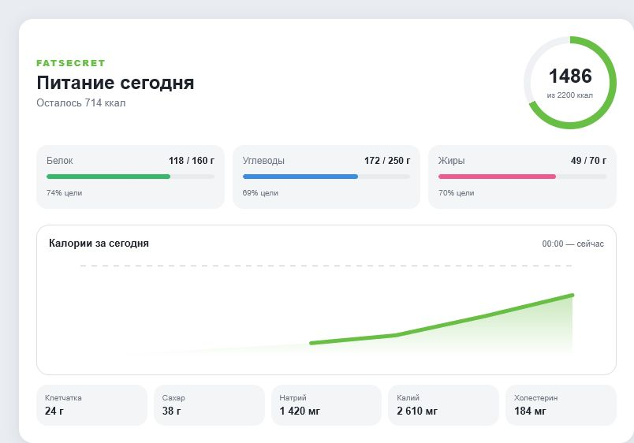

# FatSecret Dashboard Card для Home Assistant

> **English documentation:** [README.md](README.md)

Самостоятельная Lovelace-карточка для интеграции
[`xplanes/ha-fatsecret`](https://github.com/xplanes/ha-fatsecret): калории,
дневные цели, БЖУ, дополнительные нутриенты и график накопления за текущий день.



## Возможности

- устанавливается и обновляется через HACS;
- не требует Mushroom, ApexCharts или других frontend-зависимостей;
- автоматически использует стандартные entity ID интеграции `ha-fatsecret`;
- имеет визуальный редактор в Home Assistant;
- показывает выполнение целей по калориям, белку, жирам и углеводам;
- может переводить заданный процент активных калорий из выбранного сенсора в доступные на текущий день калории;
- строит суточный SVG-график калорий по истории Recorder;
- открывает стандартный more-info при нажатии на любой показатель;
- работает в широких и узких колонках, сохраняя горизонтальное расположение БЖУ;
- автоматически использует русский или английский язык Home Assistant; для остальных языков применяется английский;
- использует цвета и фон активной темы Home Assistant.

## Требования

- установленная и настроенная интеграция
  [`xplanes/ha-fatsecret`](https://github.com/xplanes/ha-fatsecret);
- Home Assistant 2024.4 или новее;
- HACS для автоматической установки.

## Установка через HACS

[](https://my.home-assistant.io/redirect/hacs_repository/?owner=BrainDeLook&repository=ha-fatsecret-dashboard&category=plugin)

Или вручную:

1. Откройте **HACS → Dashboard**.
2. В меню выберите **Custom repositories**.
3. Добавьте `https://github.com/BrainDeLook/ha-fatsecret-dashboard` с типом **Dashboard**.
4. Найдите **FatSecret Dashboard Card** и нажмите **Download**.
5. Обновите страницу Home Assistant с очисткой кеша браузера.

HACS устанавливает ресурс `ha-fatsecret-dashboard.js` автоматически.

## Добавление карточки

Откройте нужный дашборд, нажмите **Edit dashboard → Add card** и выберите
**FatSecret Dashboard**. Стандартные entity ID и цели уже заполнены; их можно
изменить в визуальном редакторе.

Минимальная YAML-конфигурация:

```yaml
type: custom:fatsecret-dashboard-card
```

Если `title` не задан, заголовок автоматически переводится вместе с интерфейсом
Home Assistant (`ru` или `en`). Пользовательский `title` всегда показывается без
изменений.

Полный пример:

```yaml
type: custom:fatsecret-dashboard-card
title: Питание сегодня
calories_entity: sensor.calories
protein_entity: sensor.protein
carbohydrate_entity: sensor.carbohydrates
fat_entity: sensor.fat
fiber_entity: sensor.fiber
sugar_entity: sensor.sugar
sodium_entity: sensor.sodium
potassium_entity: sensor.potassium
cholesterol_entity: sensor.cholesterol
use_active_calories: true
active_calories_entity: sensor.active_calories
active_calories_credit_percent: 50
calorie_goal: 2200
protein_goal: 160
carbohydrate_goal: 250
fat_goal: 70
show_graph: true
show_details: true
```

## Учёт активных калорий

Опциональный калькулятор увеличивает дневную цель на выбранную долю калорий из
любого сенсора Home Assistant. Например, при базовой цели `2200`, `640` активных
калориях и коэффициенте `50%` эффективная цель составит `2520` ккал. Остаток,
кольцо прогресса и линия цели на графике рассчитываются уже от эффективной цели.
Отключите `use_active_calories`, чтобы использовать прежнюю фиксированную цель.

Home Assistant может добавить суффикс вроде `_2`, если entity ID уже занят.
В этом случае выберите фактические сущности через визуальный редактор карточки.

## График

Карточка запрашивает краткосрочную историю `sensor.calories` напрямую из
Recorder через WebSocket API Home Assistant. Убедитесь, что сенсор калорий не
исключён из Recorder. Если история недоступна, остальные показатели продолжат
работать.

## Дополнительные YAML helpers

Файл [`packages/fatsecret.yaml`](packages/fatsecret.yaml) оставлен как
опциональный пример редактируемых helpers и template-сенсоров прогресса. Для
работы самой HACS-карточки он не нужен.

Исходная составная версия на стандартных/custom Lovelace-карточках находится в
[`dashboards/fatsecret-card.yaml`](dashboards/fatsecret-card.yaml).

## Разработка

```bash
npm run build
npm run check
```

Тестовый стенд: [`tests/preview.html`](tests/preview.html).

## Лицензия

[MIT](LICENSE)
